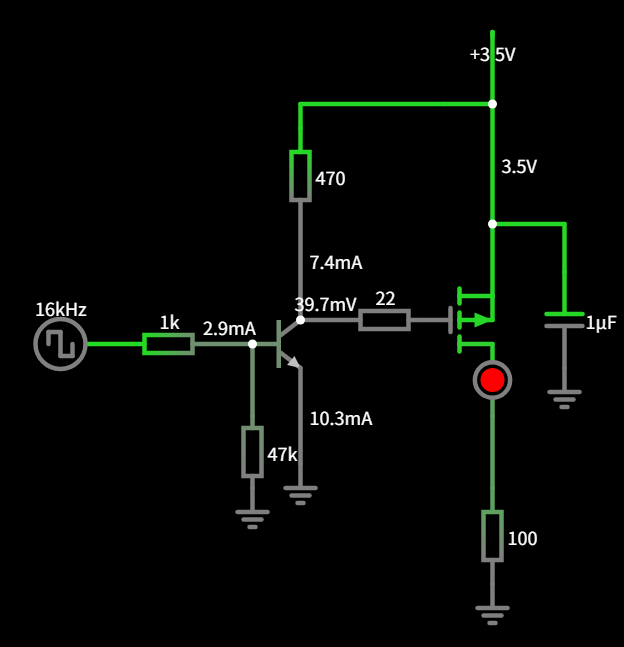
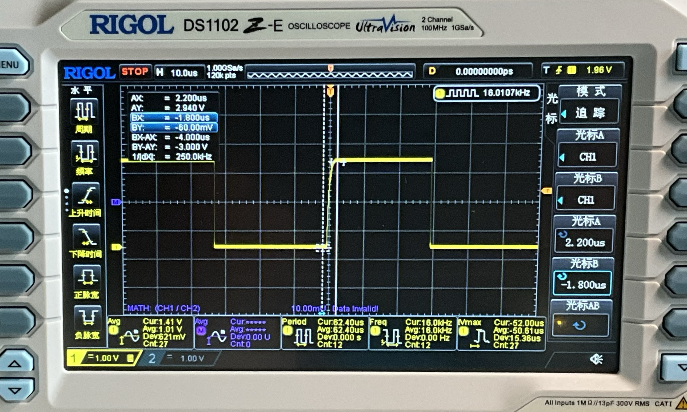
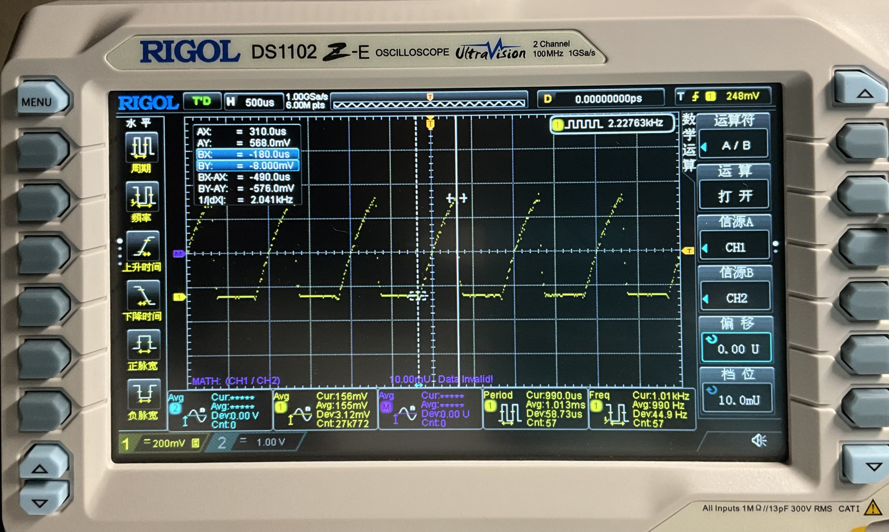
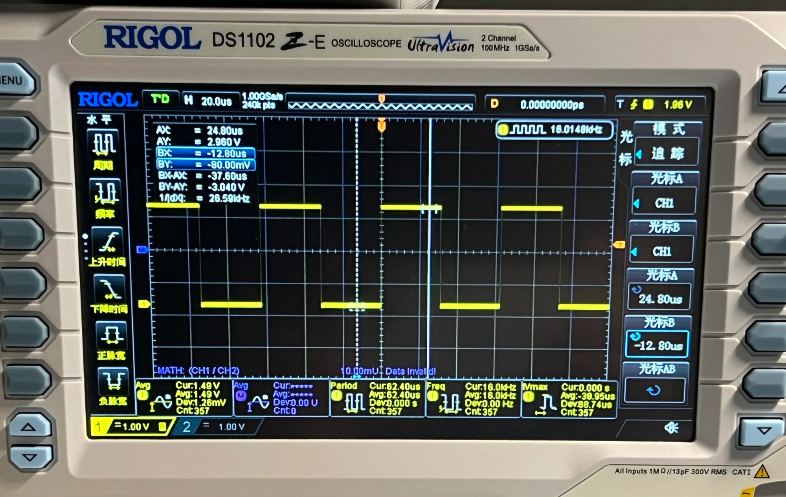
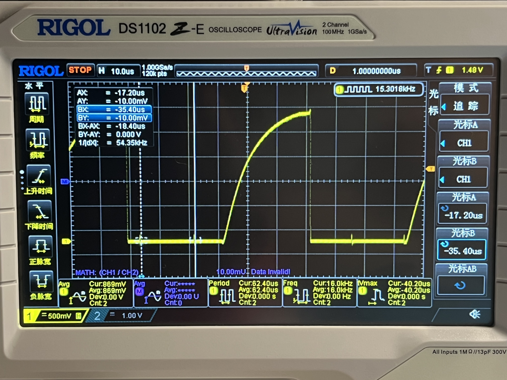
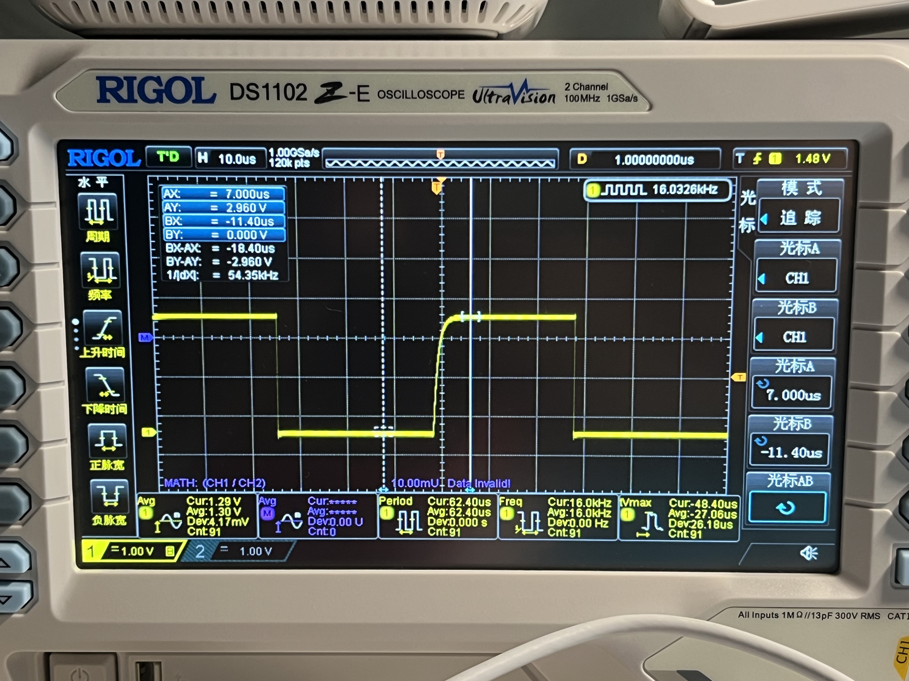
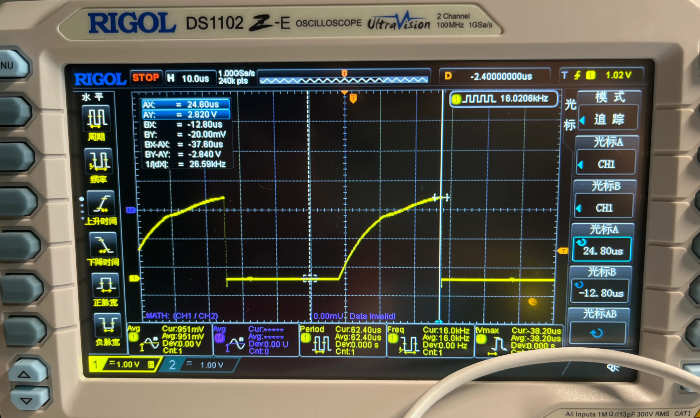
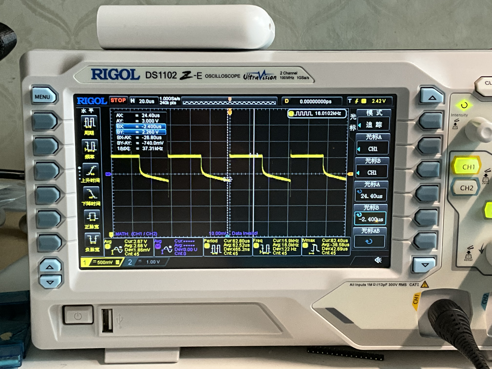

# NPN与PMOS

Status: Doing

在一次DEMO板测试的时候 出现了直接用IO控制可以拉高，但拉低后仍有1.5V电压的情况

最后方案是使用控制NPN管加速PMOS管电源的方案

# 写在前面

## 使用的NPN管 SS8050 特性

| 晶体管类型 | NPN |
| --- | --- |
| 最大集电极电流(Ic) | 1.5A |
| 最大集射极击穿电压(Vceo) | 25V |
| 最大集射极饱和电压(VCE(sat)) | 500mV |

## 使用的PMOS管 CJ2301 S1 特性

| 晶体管类型 | P沟道 |
| --- | --- |
| 漏源电压(Vdss) | 20V |
| 连续漏极电流(Id) | 2.3A |
| 导通电阻(RDS(on)) | 142mΩ@2.5V,2A |
| 阈值电压(Vgs(th)) | 1V |
| **输入电容(Ciss Cgs)** | **405pF@10V** |
| **输出电容(Coss Cgd)** | **75pF@10V** |

## 最后通过的方案

调整各部分电阻值 最后效果

t上升时间（80%Vhigh）是3us左右 可以支持到更快速的到50kHz的开关

## 写在前面的建议

- 中高频应用，PMOS 应该选用更低 Ciss Coss。
- 为了保证开关的迅速，NPN部分耗能约10mA，无法使用在低功耗设备上。

# 最早的问题

整体电路图是STM32L011使用LPTIMER输出一个1kHz的方波

我是打算用IO直接控制PMOS，PMOS去控制LED灯

IO输出直接拉了

可以看到实际上IO的电压是一个缓慢爬升的过程，示波器检测的IO最高电压只到600mV

- MOS管没有饱和：我的MCU电源是3V，完全没有到达最大的电压
- 升压时间过长：升压的时间远超设定的1kHz的区间，需要更长的时间才能饱和

其实我在设计需要极低功耗的电路，我把很多能限流的地方都限流了，应该是电流过小导致的

# 排查、调整

## IO

我断开了IO和后端的连接，并调整到更高的频率16kHz，先测试MCU IO输出是否正常

MCU 输出的波形没有什么问题 是完美的 16kHz 50% 的方波

## IO→NPN

然后将 IO 口接到 NPN 的 B级 上

搭建电路的原理图

测量 C级 的电压

波形又出现了缓慢上升的趋势，但最高只到 2.6v，且每个 20us 左右都会有一个尖刺出现。

### 分析

- 最高 2.6V 原因：SS8050 未完全饱和，且考虑饱和压降是 0.5V。
- 集级电压不足：C级电阻过大。为了低功耗，过低的减小了集电极的电流，进入饱和速度太慢。
- 基极电流不足：B级电阻和下拉电阻过大。过低的减小了基极的电流和电压。
- 尖刺产生：可能是测试飞线产生的，先不纠结，下一步处理

### 调整

- 调整基极驱动：基极电阻降低到 1kΩ，基极电流大约是 3mA，使三极管深度进入饱和。
    - 调整基极下拉电阻与基极驱动电阻的比值：调整为 47kΩ，下拉电阻比值大（ 1：50）
- 调整集电极电路：集电极电阻降低到 10kΩ，降低对电源电压的分压影响。

调整后的电路原理图

C级的波形

- t上升时间 (80%Vhigh) 是 3us 左右
- 最高电压 2.96V 接近电源电压 3V

基本实现了调整目标

## IO→NPN→PMOS→LED

原理图

测量出漏级 PMOS G级 与 NPN C级 的电压

很明显 PMOS 接入后又出现了上升缓慢、尖刺、波形不平整

### 分析

- 没有考虑 PMOS管 内电容 Cgs：内部的电容 与 集电极的电阻 形成了 RC延迟电路。
- 尖刺产生：是测试飞线产生的，在 NPN管 集电极 与 PMOS 栅极之间串联一个阻抗，减少干扰。

### 调整

- 集电极的电阻再减小至470Ω：加快 栅极-源级 级间放电速度。
- 栅极串联负载 22Ω：消除振铃

调整后的原理图

调整后 PMOS管 G端的开通波形

t上升时间 (80%Vhigh) 是3us左右。

PMOS管 D端 - LED+ 波形

整体功耗达到了 10mA*n% (PWM占空比) 

# 写在后面

- 考虑 PMOS 打开更迅速 适当降低三极管C端电阻 470Ω → 220Ω
    - 注意功耗增加到了约 15mA
- 考虑 NPN 到仍然还有干扰 接入 22Ω → 47Ω